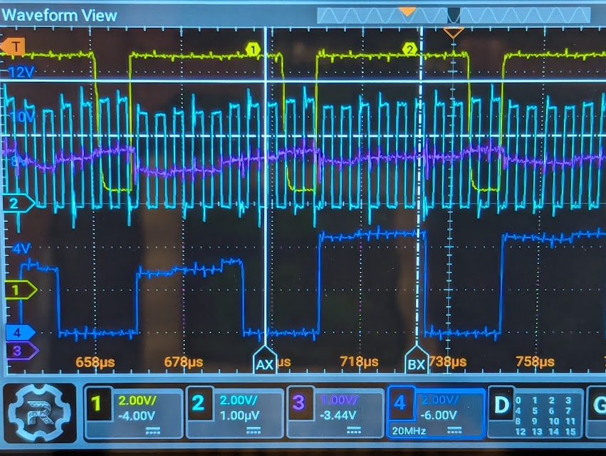
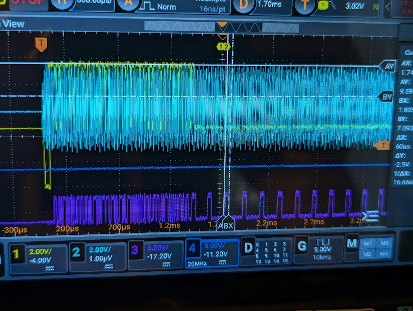

# 6500/1 Brain Dumper

Do you have a 6500/1 microcontroller made by MOS, Rockwell, or NCR? (and possibly others)
Do you want to dump the contents of the ROM? Here's a board for you!

This design is derived from work by Jim Brain documented [here](https://e4aws.silverdr.com/hacks/6500_1/)
with design files [here](https://github.com/Project-64/reloaded/tree/master/1520/extraction).

The original design was built on a breadboard. I've turned this into a simple PC board to save
you the effort of wiring it up. Along the way, I ported the code to another MCU (ATmega644) mostly
because that is what I had. I also edited the code to make it slightly more reliable by putting out
more clock cycles while RESET# is held low. (Although it is still not perfect and it usually takes
several tries to get a good dump.)

[Schematic](6500Dumper.pdf)

[Bill of Materials](6500Dumper.csv)

## Fabrication

I have not included the fab files because I haven't fabbed out and tested this board yet. Do this
at your own risk from the KiCad source files.

## Firmware

Build the firmware using the `make` command, assuming you have `avr-gcc` and all that installed.
I like to use the TL866 programmer with the `minipro` Linux software to program the ATmega.

Make sure to set the configuration fuses as follows:

* fuses\_lo = 0xff
* fuses\_hi = 0xd9
* fuses\_ext = 0xfd
* lock = 0xff

## Usage

The device works by putting the 6500/1 into test mode by applying 10V to the RESET# input. It
then bootstraps a small program into the MCU's RAM which copies the contents of the internal
ROM out through an I/O port, which the ATmega can read and route through its serial port to
the host.

After building up the board, connect a serial cable such as FTDI or a [module](https://www.sparkfun.com/products/15096).
Make sure it is configured for 5V operation! On the modules this is a little jumper or
PCB trace you have to cut and solder.

Connect an oscilloscope to the TARGET RESET test point on one channel (set to trigger on the
rising edge) and another channel to the PC1 test point (header pin 2 on J6). This will let
you tell if the 6500/1 has entered test mode and is putting out data.

Connect a 5V bench supply to the +5V and GND test points. Connect an *adjustable* bench supply
to the +10V input and GND. Set the current limit on this supply to something less than 100mA
to help prevent damage the chip under test, just in case.

If this is your first time using the board, you may want to power it up without the 6500/1
in the socket just to verify that the RESET# output behaves correctly. See the waveforms
below.

Put the 6500/1 chip into the J1 socket, and turn on the power. On the oscilloscope, you should
see the RESET# line go up to 10V, then back down to 5V, and you should see a row of pulses
on PC1. If you don't, examine the magnitude of the pulses on PC1 that occur *while RESET# is
at 10V*. Pulses that appear stunted or at around 2.5V mean that there is output contention
and the 6500/1 is not in test mode. 

**Note that CH4 (PC1) has two stunted pulses caused by output contention. CH1=reset and CH2=clock**

You might have to increase the +10V rail (but keep it below
12V or so) and then hit the reset button on the upper left to try again. It may take several tries.

If all goes well, you should see a regular set of pulses on PC1, something like this:

**CH4 (PC1) shows regular pulses after RESET# falls to 5V.**

If that is the case, binary data will be transmitted from the ATmega at 57600 baud, 8N1.
This represents the binary data read back from the 6500/1's ROM (located at address
0x800 to 0xfff). I've provided a terrible Python program, `ser_read.py` to save that to
a file. You'll want to edit it to change the filename, serial port, etc (I told you
it's bad!)

## Licensing

This program is free software; you can redistribute it and/or modify
it under the terms of the GNU General Public License as published by
the Free Software Foundation; either version 2 of the License, or
(at your option) any later version.

This program is distributed in the hope that it will be useful,
but WITHOUT ANY WARRANTY; without even the implied warranty of
MERCHANTABILITY or FITNESS FOR A PARTICULAR PURPOSE.  See the
GNU General Public License for more details.

You should have received a copy of the GNU General Public License
along with this program; if not, write to the Free Software
Foundation, Inc., 59 Temple Place, Suite 330, Boston, MA  02111-1307  USA

